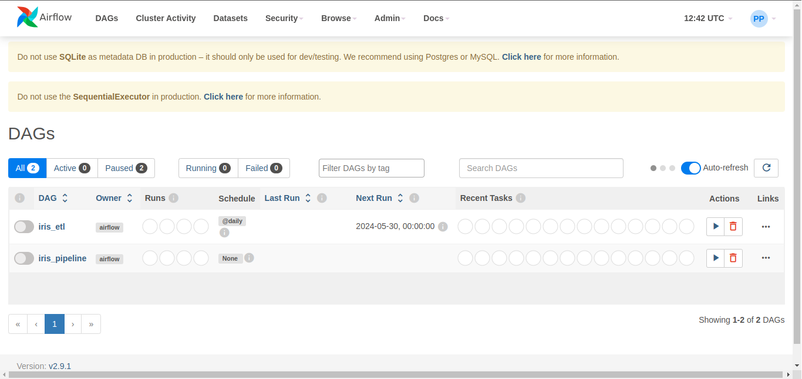

# Iris MLOps Project

Este projeto configura e executa um pipeline de dados utilizando Docker e Docker Compose. Siga as instruções abaixo para configurar e executar o projeto.

## Pré-requisitos

Certifique-se de ter o Docker e o Docker Compose instalados na sua máquina. Se não tiver, siga as instruções abaixo:

### Instalação do Docker

- [Guia de Instalação do Docker](https://docs.docker.com/get-docker/)

### Instalação do Docker Compose

- [Guia de Instalação do Docker Compose](https://docs.docker.com/compose/install/)

## Clonando o Repositório

Para clonar este repositório, execute o seguinte comando:

```bash
git clone https://github.com/helio004/iris-mlops-project.git
cd iris-mlops-project
```

# Executando o Deploy

Para executar o deploy do projeto, utilizer o comando:

```bash
make up
```

Este comando ira construir e iniciar os contêineres Docker definidos no `docker-compose.yml`

# Acessando o Airflow

Após o deploy, acesse a interface do Airflow na seguinte URL:

```bash
http://localhost:8080
```

Faça login Airflow (se necessário) e siga os próximos passos.

```
user: admin
password: admin
```

# Iniciando o ETL

1. No Airflow, encontre a DAG correspondente ao processo ETL.
2. Ative a DAG (ligue o botão ao lado do nome da DAG)
3. Inicie a DAG manualmente clicando no botão de "Trigger DAG".

# Iniciando o Pipeline de Treinamento

1. No Airflow, encontre a DAG correspondente ao processo Pipeline.
2. Ative a DAG (ligue o botão ao lado do nome da DAG)
3. Inicie a DAG manualmente clicando no botão de "Trigger DAG".



# Acessando o Modelo Treinado

Após a conclusão do pipeline de treinamento, você pode acessar o modelo treinado na seguinte URL: http://localhost:8000/docs


# Destruindo os Contêineres

```bash
make down
```

Este projeto é licenciado sob os termos da [Licença MIT](./LICENSE)